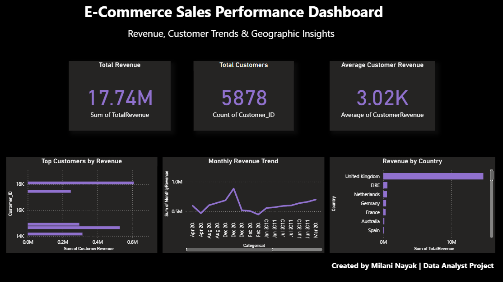

# 🛒 E-Commerce Sales Performance Dashboard (Power BI)

## 📌 Overview
This project presents an interactive Power BI dashboard designed to analyze e-commerce sales data.  
It provides insights into revenue trends, customer behavior, and geographic performance to support data-driven decision-making.

---

## 🎯 Objectives
- Analyze overall sales performance  
- Identify top customers contributing to revenue  
- Understand country-wise sales distribution  
- Track monthly revenue trends  

---

## 📊 Key Metrics
- 💰 Total Revenue  
- 👥 Total Customers  
- 📈 Average Revenue per Customer  

---

## 📈 Dashboard Features
- 📅 Monthly Revenue Trend – Track sales growth over time  
- 🌍 Revenue by Country – Identify high-performing regions  
- 🏆 Top Customers – Analyze key revenue contributors  
- 🎛️ Interactive Filters – Dynamic exploration of data  

---

## 🛠️ Tools & Technologies
- Power BI  
- Power Query (Data Cleaning & Transformation)  
- Data Modeling  

---

## 📂 Project Workflow
1. Imported raw e-commerce dataset into Power BI  
2. Cleaned and transformed data using Power Query  
3. Created relationships between tables (data modeling)  
4. Built calculated measures for KPIs  
5. Designed interactive dashboard with visuals and filters  

---

## 📷 Dashboard Preview

---

## 💡 Key Insights
- Revenue is concentrated in specific regions  
- A small group of customers contributes significantly to total revenue  
- Monthly trends reveal seasonal variations in sales  

---

## 🚀 How to Use
1. Clone or download this repository  
2. Open `dashboard.pbix` in Power BI Desktop  
3. Use filters and visuals to explore insights  

---

## 📌 Future Improvements
- Add profit and cost analysis  
- Implement sales forecasting  
- Integrate real-time data sources  

---

## 👩‍💻 Author
**Milani Nayak**  

- 💼 LinkedIn: *[(add link)](https://www.linkedin.com/in/milaninayak/)*  
- 💻 GitHub: https://github.com/milaninayak123  

---

## ⭐ Support
If you found this project useful, please consider giving it a ⭐ on GitHub!
